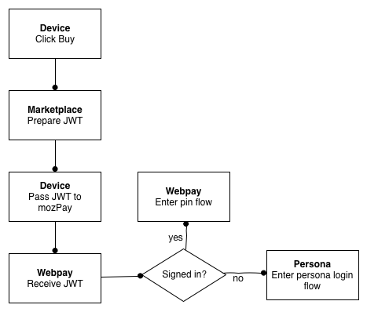
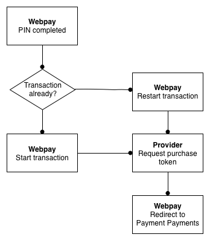

.. _flow:

=======================
End To End Payment Flow
=======================

This page covers the payment flows for the whole process. These exist to explain to other payment processors how the whole payment flow works.

Step 1: Click Buy
-----------------

User clicks buy, JWT is prepared and the payment flow starts.

Step 2 (if required): Persona Login
-----------------------------------

User authenticates using Persona.

Step 3: PIN
-----------

User creates or enters PIN.

Step 4: Start Payment
---------------------

Payment starts.

Step 5: Carrier Authentication
------------------------------

Attempt to identify phone for carrier.

.. image:: diagrams/auth-flow.png

Step 5: Payment Choice
----------------------

User chooses payment method.

.. image:: diagrams/buy-flow.png
