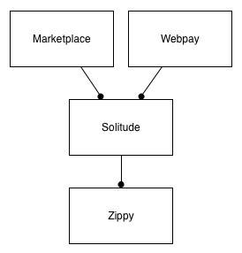

Zippy
===================================

This is a reference implementation of a payment provider. It shows the API and
endpoints a payment provider should implement in order to integrate with the
Firefox Marketplace.

This is also available as a PDF: https://media.readthedocs.org/pdf/zippypayments/latest/zippypayments.pdf

About
-----

Zippy shows payment providers how to integrate with the Firefox Marketplace
system. It shows the API calls and formats that the Marketplace will make to
the payment provider, authorization formats and so on.

Rather than being a specification to read, it is a working project. It's
important to note that underneath zippy does not actually do anything other
than record some transaction information to allow APIs to work. Specifically it
does not:

* try and actually charge carrier billing
* try and charge a credit card
* process any money at all

That is all faked out. It's up to the individual payment provider to implement
that. Here's how zippy fits into the marketplace infrastructure.

It is licensed under the Mozilla Public License v2.0 and contributions are more
than welcome.

Source: https://github.com/mozilla/zippy/

Bugs: https://bugzilla.mozilla.org/show_bug.cgi?id=905736

Mailing list: https://lists.mozilla.org/listinfo/dev-marketplace

Using Zippy
-----------

Everything you need to know about data formats, protocols, authentication and
the like. See the :ref:`using zippy documentation <using-label>`.

Sellers
~~~~~~~

In Zippy, **sellers** are the **developers** who are wanting to place something
for sale on the app market. They will need to create an account with the
payment provider:

* Setting up a developer account so that a developer can recieve payment.
* Registering one or more products with the payment provider.
* Any further configuration that the product needs.
* Confirming that data is all set up correctly.

See the :ref:`developer documentation <developer-label>`.

Payment
~~~~~~~

* The actual payment part of the flow.
* Starting the payment flow.
* Pages that should be shown and hosted by the payment provider.
* The result after the payment has been completed.

See the :ref:`payment documentation <payment-label>`.

Reporting
~~~~~~~~~

* Reporting of transactions back to developers.

See the :ref:`reporting documentation <reporting-label>` documentation.

Miscellaneous
~~~~~~~~~~~~~

* Refunds and chargebacks, see :ref:`refunds <refunds-label>`
* Token checking and other security, see :ref:`security <security-label>`
* Status, see :ref:`status <status-label>`

Contents
--------

.. toctree::
   :maxdepth: 3

   install.rst
   using.rst
   developer.rst
   payment.rst
   api.rst
   auth.rst
   reporting.rst
   refunds.rst
   security.rst
   miscellaneous.rst
   tests.rst
   flow.rst
   faq.rst

Indices and tables
==================

* :ref:`genindex`
* :ref:`modindex`
* :ref:`search`
