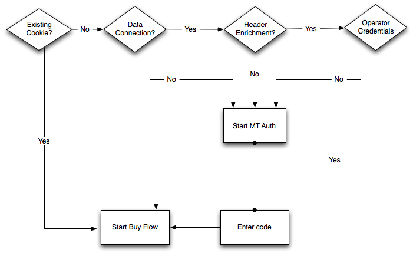
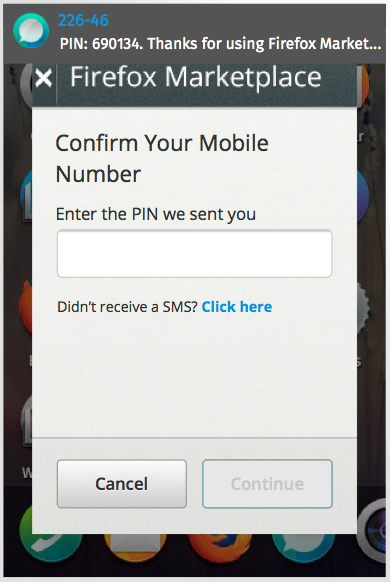
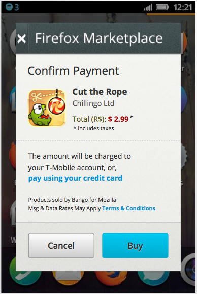
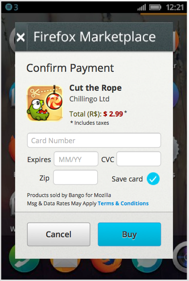
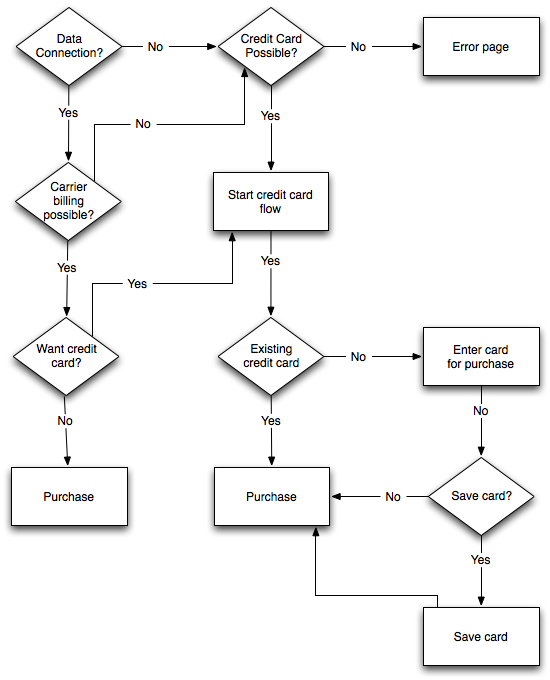

.. _payment-label:

Payment
=======

When processing the payment, Zippy simulates charging money for digital goods.
When finished, it redirects to the
payment provider (such as `WebPay`_) and sends a post notification. We provide
:ref:`flows <payment-diagrams>` to explain the decisions that are made and
the screens that are shown. Exactly what will happen here depends upon the
payment processor and the configuration.
After these steps have been completed, Zippy will return to the success or error
URL. See the :ref:`redirect-api` for details.

A real payment processor would probably do things like this:

* Authentication: set up a user for billing, perhaps with
  SMS authentication.
* Direct billing: place a charge on a user's mobile bill.
* Credit card billing.

.. _WebPay: https://github.com/mozilla/webpay

.. _redirect-api:

How Redirects Work
------------------

When Zippy completes a transaction it redirects to the original success or
error URL (see :ref:`transactions` API for how those are defined).
In the case of success, the application that began payment would respond with
the HTML/CSS/JS needed to dispurse the goods.

A few query string parameters are added to the URL that you can use to
reconcile the payment.

**ext_transaction_id**
    This is the original (external) transaction ID that was submitted to the
    :ref:`transaction <transactions>` API as ``ext_transaction_id``.

**error**
    For error redirects only, this string will indicate the type of error.
    Example: ``CC_ERROR``. Note: it's up to each payment processor to
    define their own error codes.

Example: ``https://site/payments/success/?ext_transaction_id=XYZ``

.. note::

   A signed query string notice must be :ref:`verified <notice-api>` before any of
   the values can be trusted.

How Post Notifications Work
---------------------------

When Zippy completes a transaction it not only redirects to the success/error
URL, it also sends a post notification in the background. There are some edge
cases in web user agents that could interrupt a redirect request so post
notifications are generally more reliable. An application processing a payment
should expect to continue the payment flow after redirect but should use post
notifications as an additional measure to reconcile payment results.

An application configures its callback URLs when beginning a
:ref:`transaction <transactions>`. Zippy will post a single parameter called
``signed_notice`` to either the callback success or error URL.
This parameter contains a URL-encoded, signed notice that must be
:ref:`verified <notice-api>` and
then URL-decoded.

The notice query string has the same parameters as the one sent in a
:ref:`redirect <redirect-api>`.

.. _transactions:

Transactions
------------

This API enables you to begin a transaction so that a product can be purchased.

.. http:post:: /transactions

    **Request**

    :param price:
        Decimal amount of the purchase price. Example: ``0.99``.
    :type price: decimal

    :param currency:
        ISO currency code for the purchase price. Examples: ``EUR``, ``USD``.
    :type currency: string

    :param carrier:
        Mobile carrier that the user is on when making a purchase.
        Example: ``TMOBILE``.
    :type carrier: string

    :param region:
        Numeric MCC (Mobile Country Code) of the region that the user is in
        when beginning the transaction. Example: ``300``.
    :type region: string

    :param success_url:
        Fully qualified URL to where Zippy should redirect to after a successful
        payment. Example: ``https://marketplace.firefox.com/mozpay/provider/success``.
    :type success_url: url

    :param error_url:
        Fully qualified URL to where Zippy should redirect to after a payment
        error. Example: ``https://marketplace.firefox.com/mozpay/provider/error``.
    :type error_url: url

    :param callback_success_url:
        Fully qualified URL to where Zippy should issue a ``POST`` request
        if the payment is accepted with a ``signed_notice`` parameter
        (a "stringified" version of the parameters returned by the creation
        of the transaction). Example:
        ``https://marketplace.firefox.com/mozpay/provider/callback/success``.
    :type callback_success_url: url

    :param callback_error_url:
        Fully qualified URL to where Zippy should issue a ``POST`` request
        if the payment is NOT accepted with a ``signed_notice`` parameter
        (a "stringified" version of the parameters sent for the creation
        of the transaction). Example:
        ``https://marketplace.firefox.com/mozpay/provider/callback/error``.
    :type callback_error_url: url

    :param ext_transaction_id:
        An external transaction ID (string). This would be a merchant's own
        transaction ID, such as `Webpay`_'s transaction ID. This will be
        returned to the merchant in a payment notice for reconciliation.
    :type ext_transaction_id: string

    :param pay_method:
        Method of payment requested. Possible values:

        ``CARD``
            Credit card.
        ``OPERATOR``
            Mobile operator billing.
    :type pay_method: string

    :param product_id:
        Primary key of :ref:`product <products>` about to be purchased.
    :type product_id: string

    :param product_image_url:
        An optional sanitized image URL to display the logo of the product.
        A default image will be displayed during the payment process
        if that field is not submitted.

    For example:

    .. code-block:: json

        {
          "price":"0.89",
          "currency":"EUR",
          "pay_method": "OPERATOR",
          "carrier": "TMOBILE",
          "region": 300,
          "product_id": 1,
          "success_url": "https://yoursite.org/success",
          "error_url": "https://yoursite.org/error",
          "callback_success_url": "https://yoursite.org/callback/success",
          "callback_error_url": "https://yoursite.org/callback/error",
          "product_image_url": "http://example.org/image.jpg",
          "resource_pk": "1",
          "resource_name": "transactions",
          "resource_uri": "/transactions/1"
        }

    **Response**

    The created transaction is returned to you with a few extra fields.

    :param status:
        The status of the transaction.
    :type string:

    :param token:
        Unique token that can be used to address this transaction.
    :type string:

    For example:

    .. code-block:: json

        {
          "status": "started",
          "token": "f74b2b68ad5cce2c07b14e06ed67b76e56ab91196bac605...",
        }

    In case of an error:

    .. code-block:: json

        {
          "code": "InvalidArgument",
          "message": {
            "product_id": "This field is required."
          }
        }

    :status 201: success.
    :status 409: conflict.

Style guide
~~~~~~~~~~~

Zippy contains a full style guide containing the CSS, HTML and JS to be used on
a page. It will also contain localisations.

If a page has been implemented in zippy, then it can be used by a payment
provider by copying and pasting over the code into the existing payment
providers framework. It might be worth payment providers thinking about this
step as it creates a bit of a long term maintenance issue.

The style guide is accessible in your zippy checkout, or here:

http://zippy.paas.allizom.org/styleguide

.. _payment-diagrams:

Carrier Authentication
----------------------

.. note:: This shows what is existing in production with Bango as of Nov 2013.

This is a basic flow for how carrier authentication works.

SMS Authentication
------------------

.. note:: Not currently implement in zippy.

This shows a flow and screens where a payment provider discovers the user via
SMS messages to the phone.

Example:

.. image:: images/sms-auth.png

.. _Webpay: https://github.com/mozilla/webpay

Payment page
------------

Carrier billing page
~~~~~~~~~~~~~~~~~~~~

.. note:: Not currently implemented in zippy.

Example:

Credit card
~~~~~~~~~~~

.. note:: Currently implemented in zippy in the templates.

Example:

Credit card or carrier billing
~~~~~~~~~~~~~~~~~~~~~~~~~~~~~~

.. note:: This shows what is existing in production with Bango as of Nov 2013.

Currently when a user lands on the buy page, the user has to choose between
using carrier billing or a credit card. This diagram outlines the choices.

