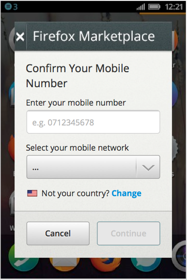

.. _payment-label:

Payment
=======

When processing the payment, Zippy simulates charging money for digital goods.
When finished, it redirects to the
payment provider (such as `WebPay`_). We provide
:ref:`flows <payment-diagrams>` to explain the decisions that are made and
the screens that are shown. Exactly what will happen here depends upon the
payment processor and the configuration.
After these steps have been completed, Zippy will return to the success or error
URL. See the :ref:`redirect-api` for details.

A real payment processor would probably do things like this:

* Authentication: set up a user for billing, perhaps with
  SMS authentication.
* Direct billing: place a charge on a user's mobile bill.
* Credit card billing.

.. _WebPay: https://github.com/mozilla/webpay

.. _redirect-api:

Redirect API
------------

When Zippy completes a transaction it redirects to the original success or
error URL (see :ref:`transactions` API for how those are defined).
A few query string parameters are added to the URL that you can use to
reconcile the payment.

**ext_transaction_id**
    This is the original (external) transaction ID that was submitted to the
    :ref:`transaction <transactions>` API as ``ext_transaction_id``.

**error**
    For error redirects only, this string will indicate the type of error.
    Example: ``CC_ERROR``. Note: it's up to each payment processor to
    define their own error codes.

Example: ``https://site/payments/success/?ext_transaction_id=XYZ``

.. _transactions:

Transactions
------------

This API enables you to begin a transaction so that a product can be purchased.

.. http:post:: /transactions

    **Request**

    :param price:
        Decimal amount of the purchase price. Example: ``0.99``.

    :param currency:
        ISO currency code for the purchase price. Examples: ``EUR``, ``USD``.

    :param carrier:
        Mobile carrier that the user is on when making a purchase.
        Example: ``TMOBILE``.

    :param region:
        Numeric MCC (Mobile Country Code) of the region that the user is in
        when beginning the transaction. Example: ``300``.

    :param success_url:
        Fully qualified URL to where Zippy should redirect to after a successful
        payment. Example: ``https://marketplace.firefox.com/mozpay/provider/success``.

    :param error_url:
        Fully qualified URL to where Zippy should redirect to after a payment
        error. Example: ``https://marketplace.firefox.com/mozpay/provider/error``.

    :param ext_transaction_id:
        An external transaction ID (string). This would be a merchant's own
        transaction ID, such as `Webpay`_'s transaction ID. This will be
        returned to the merchant in a payment notice for reconciliation.

    :param pay_method:
        Method of payment requested. Possible values:

        ``CARD``
            Credit card.
        ``OPERATOR``
            Mobile operator billing.

    :param product_id:
        Primary key of :ref:`product <products>` about to be purchased.

    **Response**

    The created transaction is returned to you with a few extra fields.

    :param status:
        The status of the transaction.

    :param token:
        Unique token that can be used to address this transaction.

    For example:

    .. code-block:: json

        {
          "status": "started",
          "token": "f74b2b68ad5cce2c07b14e06ed67b76e56ab91196bac605...",
          "price":"0.89",
          "currency":"EUR",
          "pay_method": "OPERATOR",
          "carrier": "TMOBILE",
          "region": 300,
          "product_id": 1,
          "success_url": "https://yoursite.org/success",
          "error_url": "https://yoursite.org/error",
          "resource_pk": "1",
          "resource_name": "transactions",
          "resource_uri": "/transactions/1"
        }

    In case of an error:

    .. code-block:: json

        {
          "code": "InvalidArgument",
          "message": {
            "product_id": "This field is required."
          }
        }

    :status 201: success.
    :status 409: conflict.

Style guide
~~~~~~~~~~~

Zippy contains a full style guide containing the CSS, HTML and JS to be used on
a page. It will also contain localisations.

If a page has been implemented in zippy, then it can be used by a payment
provider by copying and pasting over the code into the existing payment
providers framework. It might be worth payment providers thinking about this
step as it creates a bit of a long term maintenance issue.

The style guide is accessible in your zippy checkout, or here:

http://zippy.paas.allizom.org/styleguide

.. _payment-diagrams:

Carrier Authentication
----------------------

.. note:: This shows what is existing in production with Bango as of Nov 2013.

This is a basic flow for how carrier authentication works.

.. image:: diagrams/auth-flow.png

SMS Authentication
------------------

.. note:: Not currently implement in zippy.

This shows a flow and screens where a payment provider discovers the user via
SMS messages to the phone.

Example:

.. _Webpay: https://github.com/mozilla/webpay

Payment page
------------

Carrier billing page
~~~~~~~~~~~~~~~~~~~~

.. note:: Not currently implemented in zippy.

Example:

.. image:: images/carrier-billing.png

Credit card
~~~~~~~~~~~

.. note:: Currently implemented in zippy in the templates.

Example:

.. image:: images/credit-card.png

Credit card or carrier billing
~~~~~~~~~~~~~~~~~~~~~~~~~~~~~~

.. note:: This shows what is existing in production with Bango as of Nov 2013.

Currently when a user lands on the buy page, the user has to choose between
using carrier billing or a credit card. This diagram outlines the choices.

.. image:: diagrams/buy-flow.png
